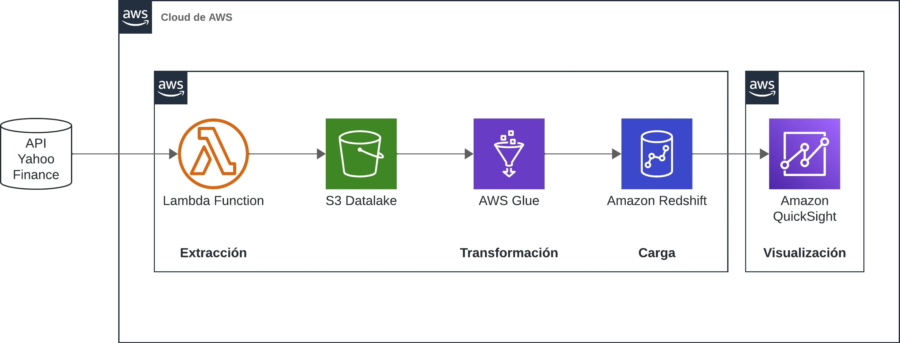

# Ingeniería de Datos con AWS y Yahoo Finance

AWS ofrece un conjunto robusto de servicios de computación en la nube, incluyendo más de 200 servicios que cubren infraestructura como servicio (IaaS), plataforma como servicio (PaaS), y software como servicio (SaaS). Para obtener más información sobre estos tipos de servicios, visita <a href="https://aws.amazon.com/es/types-of-cloud-computing/">Tipos de Computación en la Nube de AWS</a>.

## Tabla de Contenidos
- [Descripción del Proyecto](#descripción-del-proyecto)
- [Stack Tecnológico](#stack-tecnológico)
- [Flujo de Trabajo](#flujo-de-trabajo)
- [Ayuda](#ayuda)

## Descripción del Proyecto

Haga clic para expandir

 
En esta demostración, seleccionamos seis servicios de AWS, que son principalmente PaaS (Platform as a Service). Esto elimina la necesidad de administrar infraestructura subyacente como hardware y sistemas operativos. El objetivo del proyecto es crear un pipeline de datos automatizado que obtenga datos de la API de Yahoo Finance, realice un preprocesamiento de esos datos, y finalmente los ponga a disposición en un servicio accesible para consultas de usuarios.

## Stack Tecnológico

Haga clic para expandir

 
A continuación, detallamos las tecnologías que conforman nuestro stack:

 
1. **[AWS Lambda](https://docs.aws.amazon.com/lambda)**
   - **Descripción:** AWS Lambda es un servicio de computación sin servidor que permite ejecutar código en respuesta a eventos y automáticamente gestiona los recursos de cómputo. Nos permite ejecutar funciones sin necesidad de aprovisionar ni administrar servidores.
   - **Uso en este Proyecto:** Utilizamos Lambda para implementar funciones que se ejecutan periódicamente para obtener datos desde la API de Yahoo Finance. AWS Lambda nos permite ejecutar código sin aprovisionar ni administrar servidores. Simplemente subimos nuestro código y Lambda se encarga de todo lo necesario para ejecutar y escalar nuestro código con alta disponibilidad.

2. **[Amazon S3 (Simple Storage Service)](https://docs.aws.amazon.com/s3)**
   - **Descripción:** Amazon S3 es un servicio de almacenamiento de objetos que ofrece escalabilidad, disponibilidad de datos, y rendimiento de alta velocidad. Es ideal para almacenar y proteger cualquier cantidad de datos para una variedad de casos de uso, como aplicaciones de datos, sitios web y más.
   - **Uso en este Proyecto:** Este servicio de almacenamiento IaaS es usado para guardar los datos recogidos desde la API de Yahoo Finance. Amazon S3 ofrece almacenamiento escalable y duradero para cualquier cantidad de datos.

3. **[AWS Glue](https://docs.aws.amazon.com/glue)**
   - **Descripción:** AWS Glue es un servicio de ETL (extracción, transformación y carga) completamente administrado que facilita la preparación y carga de sus datos para el análisis. Con Glue, puedes crear y ejecutar trabajos ETL en cuestión de minutos.
   - **Uso en este Proyecto:** Encargado del procesamiento ETL, facilitando la preparación de los datos para su análisis. AWS Glue nos permite extraer datos de S3, transformarlos según nuestras necesidades y cargarlos en Amazon RDS.

4. **[Amazon RDS (Relational Database Service)](https://docs.aws.amazon.com/rds)**
   - **Descripción:** Amazon RDS facilita la configuración, operación y escalado de bases de datos relacionales en la nube. Proporciona capacidad rentable y redimensionable al tiempo que automatiza las tareas administrativas de administración de bases de datos.
   - **Uso en este Proyecto:** Almacena los datos preprocesados en un sistema de base de datos relacional, listos para ser consultados. Amazon RDS nos permite tener una base de datos gestionada donde se almacenan los datos transformados para su posterior consulta y análisis.

5. **[Amazon QuickSight](https://docs.aws.amazon.com/quicksight)**
   - **Descripción:** Amazon QuickSight es una herramienta de visualización de datos y business intelligence que permite crear y publicar paneles interactivos que incluyen visualizaciones avanzadas, análisis de datos, y más. Es un servicio de BI rápido, fácil de usar y basado en la nube.
   - **Uso en este Proyecto:** Herramienta de visualización de datos y business intelligence que se conecta directamente a Amazon RDS para ofrecer análisis visuales. Utilizamos QuickSight para crear dashboards y visualizaciones basadas en los datos almacenados en RDS.

6. **[Amazon EventBridge (anteriormente Amazon CloudWatch Events)](https://docs.aws.amazon.com/eventbridge)**
   - **Descripción:** Amazon EventBridge es un bus de eventos que facilita la conexión de aplicaciones utilizando datos generados por sus aplicaciones, software como servicio (SaaS) y servicios de AWS.
   - **Uso en este Proyecto:** Utilizado para programar y disparar funciones de AWS Lambda según un cronograma establecido. EventBridge nos permite automatizar la ejecución periódica de las funciones Lambda para obtener datos de Yahoo Finance regularmente.

Este stack tecnológico integral nos brinda las herramientas necesarias para gestionar grandes conjuntos de datos, realizar análisis complejos y presentar de manera efectiva los resultados a través de interfaces interactivas.

## Flujo de Trabajo

Haga clic para expandir

1. **Crear un bucket en Amazon S3:** Almacenamos los datos obtenidos desde la API de Yahoo Finance.

2. **Obtener datos de la API de Yahoo Finance usando AWS Lambda:** Automatizamos la recolección de datos de mercado de valores y los guardamos en S3.

3. **Procesar y transformar los datos con AWS Glue:** Preparamos los datos para su análisis realizando diversas transformaciones.

4. **Almacenar los datos en Amazon RDS:** Guardamos los datos procesados en una base de datos relacional, listos para ser consultados.

5. **Visualizar los datos con Amazon QuickSight:** Creamos visualizaciones interactivas para analizar los datos.

6. **Utilizar Amazon EventBridge para la programación:** Programamos y disparamos funciones de AWS Lambda según un cronograma establecido.

Haz Click [aquí](./Instructivo:%20Paso%20a%20Paso/) para ir al instructivo.

## Ayuda

Cualquier pregunta, duda o comentario pueden dirigirse directamente al discord del **Data Cloud Club** o directamente conmigo vía **LinkedIn**.

<table align="center" border="0" style="border-collapse: collapse;">
  <tr>
    <td align="center" style="border: none;">
      
       
      <strong style="font-size: 14px;">Sebastian Armijo</strong>
       
      <a href="https://www.linkedin.com/in/sebastianarmijo/" style="font-size: 12px;">LinkedIn</a>
    </td>
    <td align="center" style="padding-left: 30px; border: none;">
      
       
      <strong style="font-size: 14px;">Data Cloud Club</strong>
       
      <a href="https://discord.gg/bpKXJz5ZQw" style="font-size: 12px;">Discord</a>
    </td>
  </tr>
</table>
